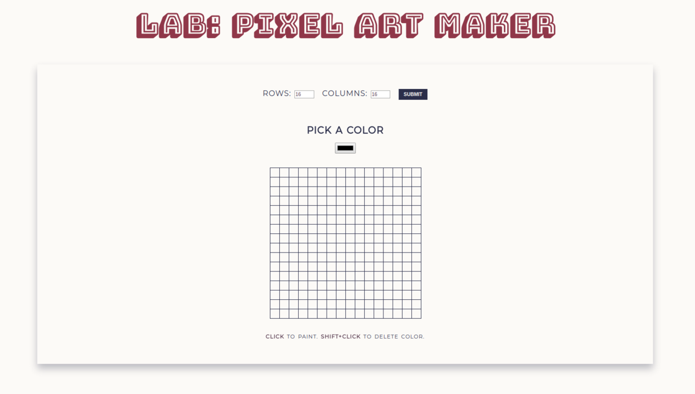

# Pixel Art Maker v2

### Description & Motivation

This was the final project of the [Google Developer Challenge Scholarship](https://www.udacity.com/google-scholarships), of which I was one of the competitors a couple months ago. I won the full Google Scholarship and now I am doing the Front End Nanodegree at Udacity.

This time around, the Pixel Art Maker is not one of the main projects, but merely an exercise. Here is my coding journey log from back when I tackled this project:

> I found this Pixel Art Maker project challenging, because I only started learning JavaScript and programming about a month ago. Some of the requirements were:

> * To use loops to create the grid, and to determine grid size based on user input.
> * To add event listeners to the relevant DOM elements, so color values and table sizes could be dynamically set by user.

> On top of that, I decided to use this project to also practice the BEM methodology, and work on my Sass/SCSS skills.

### Tech/framework used

Made with:

* HTML
* CSS
* Sass / SCSS
* jQuery

### Demo

* [Live demo](https://mairamartinsk.github.io/pixel-art-maker/)
* [Code playground](https://codepen.io/mairamartinsk/pen/dZmXJq)

