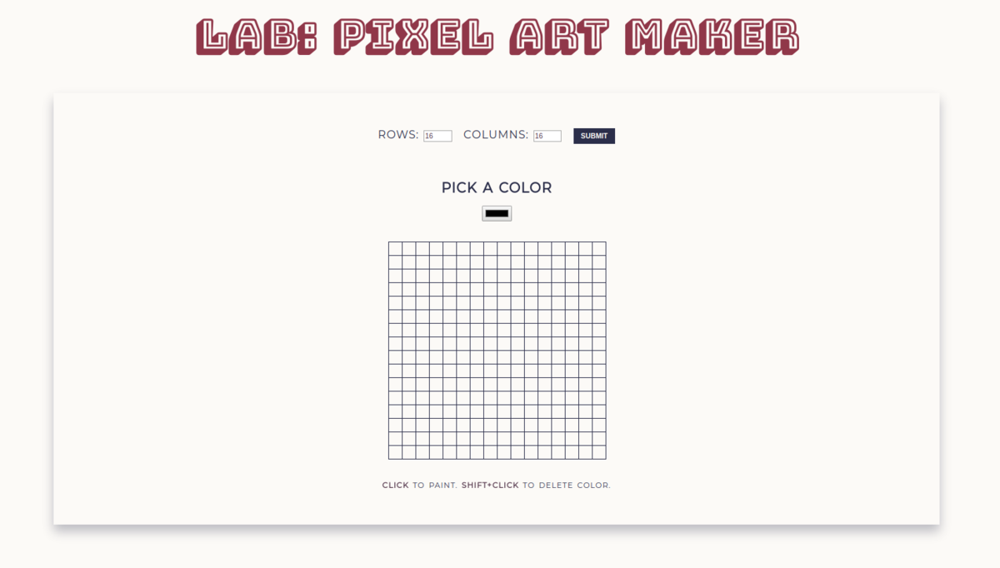

# Pixel Art Maker Project

### Description & Motivation

This is the final project of the [Google Developer Challenge Scholarship](https://www.udacity.com/google-scholarships), powered by Google and Udacity. I am on the Front End Web Developer - Beginner track. The course taught HTML, CSS, vanilla JavaScript and some jQuery, all on an introductory level.

I found this Pixel Art Maker project challenging, because I only started learning JavaScript and programming about a month ago. Some of the requirements were:

* To use loops to create the grid, and to determine grid size based on user input.
* To add event listeners to the relevant DOM elements, so color values and table sizes could be dynamically set by user.

On top of that, I decided to use this project to also practice the BEM methodology, and work on my Sass/SCSS skills.

### Tech/framework used
Made with:
* HTML
* CSS
* Sass / SCSS
* jQuery

### Demo
* [Live demo](https://mairamartinsk.github.io/pixel-art-maker/)
* [Code playground](https://codepen.io/mairamartinsk/pen/dZmXJq)

